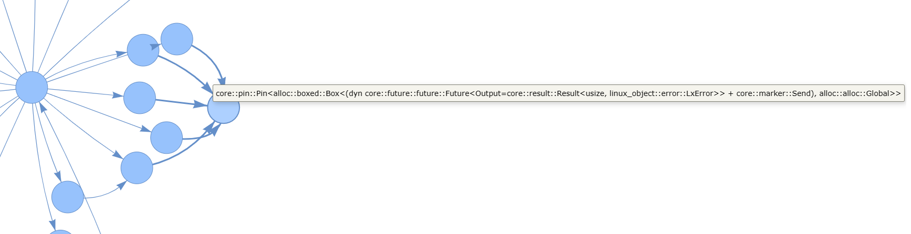
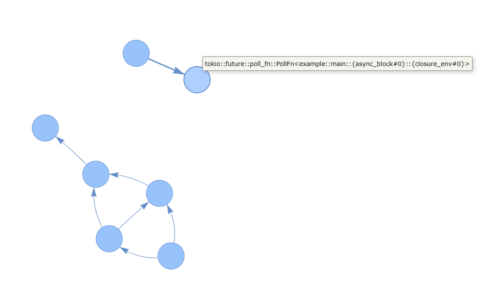

# async函数跟踪总结

## 一些参考

关于rust async的很好的介绍：<https://night-cruise.github.io/async-rust/>

async rust debugging的tracking issue：<https://github.com/rust-lang/rust/issues/73522>

## async函数的跟踪思路

### stacktrace
在正在执行的async函数里，可以用栈帧直接进行stacktrace，与正常函数一样。如果想要完整的调用链可以引入debuginfo获取inline函数的信息。

得到的符号和一般函数会有区别，函数主体的符号会变成闭包，也会出现poll函数的符号以及使用的async runtime的相关函数。

如果想增强这些符号的可读性，可以加入编译选项`-Csymbol-mangling-version=v0`，这个RFC也会让其他函数的符号更加可读。

在最新的编译器版本里，async函数生成时不再经过一层Genfuture，从而stacktrace更加简洁(https://github.com/rust-lang/rust/pull/104321)。

如果要跟踪已经yield的async函数就不能通过栈追踪的方式了。栈里是没有挂起的协程的执行信息的。追踪挂起的函数有几种思路：

### 静态追踪点
在async函数代码里插入静态追踪点是最直接的方法。tokio的[async-backtrace](https://crates.io/crates/async-backtrace)就是这么实现的。给每个async函数用宏在外面套一层async函数，在poll的时候就可以通过自己套的async函数里的poll获取结果，汇报给全局tracer处理即可。在async函数上加入对应的跟踪宏即可自动汇报他们的执行情况。

但是从kprobe的角度来看，我们希望能够不修改代码，仅依赖编译器给出的信息定位async函数的执行流进行插桩，也就是动态的跟踪一个async函数是否执行完毕，是否在Yield中。

在目前的编译器的编译结果下，有几种思路：

### 跟踪poll函数
对poll函数进行插桩，用retprobe截取返回值理论上是可以判断一个future是否完成的，但是有几个问题：

1. 使用.await生成的poll函数会生成比较复杂的符号，生成的结果还和具体async实现有关，需要手动去dwarf里查找，很难直接从原本的async函数名里获取（或者说，编译器不会emit这类信息），之前静态插桩就是通过插入代码获取了这个信息。
2. .await生成的poll函数很可能被inline优化掉，retprobe无法获取返回值，获取的信息有限。
3. 对于非leaf的future，只能判断他是否完成，无法知道状态机的具体状态，而递归插桩子future还是需要编译器的信息。

如果想获取更多的信息，需要深入到函数的具体执行流里，也就是尝试通过跟踪闭包来实现。

### 跟踪生成的闭包
我们可以从DWARF里找到async/await生成的struct：
``` rust
struct example::what::{async_fn_env#0}
	size: 3
	members:
		0[1]	__state: u8
		0[3]	<variant part>
			Unresumed: <0>
			Returned: <1>
			Panicked: <2>+
			Suspend0: <3>
				0[1]	<padding>
				1[2]	__awaitee: struct example::barrr::{async_fn_env#0}
			Suspend1: <4>
				0[1]	<padding>
				1[1]	__awaitee: struct example::baz::{async_fn_env#0}
				2[1]	<padding>
```
对应（旧版）编译器里的逻辑：
```
/// Desugar `<expr>.await` into:
/// ```ignore (pseudo-rust)
/// match ::std::future::IntoFuture::into_future(<expr>) {
///     mut __awaitee => loop {
///         match unsafe { ::std::future::Future::poll(
///             <::std::pin::Pin>::new_unchecked(&mut __awaitee),
///             ::std::future::get_context(task_context),
///         ) } {
///             ::std::task::Poll::Ready(result) => break result,
///             ::std::task::Poll::Pending => {}
///         }
///         task_context = yield ();
///     }
/// }
/// ```
```
这也是为了改善async函数的debug支持而对编译器做的改动之一<https://github.com/rust-lang/rust/pull/95011>。

每个Suspend就是一句await语句，awaitee就对应了子future。所以可以从debuginfo里解析出代码里future的依赖关系。

有依赖树以后可以考虑根据闭包的执行情况跟踪。不过仍然有几个问题：

1. 这个结构仅限于await语句，如果使用select!或者join!等宏或是手动实现Future的话，会构造新的future而不是使用await，这样的await树可能会断开。
2. 用trait抽象出的awaitee是无法通过静态分析获取的。
3. 如果一个closure被inline的话仍然没法通过retprobe知道具体的执行情况。

所以这么解析出的依赖关系也不是完整的，就算是完整的也没办法直接追踪。

写了一个小工具<https://github.com/cubele/rust-async-tree-parser>用来可视化这个依赖树，以zCore为例：



可以看到read相关的系统调用里面await的future被抽象了，所以依赖树找不到实体的future。

再比如join!的情况：



被join的await逻辑和join本身分离了。

所以说async函数根本的执行情况还是要通过poll获取的。

### 仅跟踪leaf future
__awaitee可以帮助我们找到.await生成的结构，但会在一些没有使用await的Future处断开。但是可以发现断开的地方肯定是代码（而不是编译器通过.await）实现了Future对应的poll函数的，所以这些"leaf"的poll函数是可以直接插桩的。也就是说我们可以退一步，不去自顶向下的关注async函数的整体流程，而是观测一些关键的poll函数。因为async真正的异步一般都出现在这种底层Future里，这样跟踪已经可以获取足够的信息了。

既然我们直接跟踪具体实现的一个poll函数，插桩的时候就没有之前的问题了。不过获取返回值的话可能还是需要no_inline。

而如果关注的不是Future而是async函数本身的执行，可以直接在函数生成的闭包上插桩，甚至可以直接用line2addr定位具体的一句话插桩。
## 一个例子
zCore中的SleepFuture的poll函数没有被inline，直接可以在符号表里找到`<kernel_hal::common::future::SleepFuture as core::future::future::Future>::poll`，插桩以后可以看到Waker触发前后两次poll分别返回Pending和Ready。

## 总结
如果是作为debug手段的话，用async-backtrace这个库插入静态追踪点肯定是最好的办法。而动态跟踪async函数具体的执行情况情况比较困难，根本原因是编译器没有做相关的debuginfo。但是可以通过解析编译器emit的awaitee信息找到找到leaf future，定位其中显式实现的poll函数，对这些poll进行probe，与插桩closure结合判断执行过程。

从另一个角度看，.await生成的poll依赖并不是probe动态跟踪最关心的部分，关键的是可能阻塞的底层Future。所以没有必要对await生成的代码进行动态追踪（编译器目前也没有支持），在debug的时候用静态插桩就足够了。

因为async rust并不成熟，相关的编译流程以及debug支持都在不断的改进中。debuginfo可以关注tracking issue<https://github.com/rust-lang/rust/issues/73522>，async函数的编译过程改进可以看看<https://swatinem.de/blog/improving-async-codegen/>。
